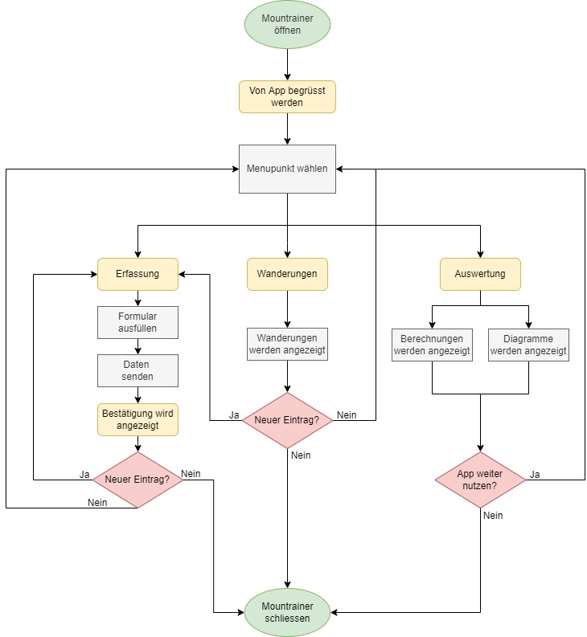

# Mountrainer

##Inhalt
1. Ausgangslage des Projekts
2. Funktion/Projektidee
3. Betrieb
4. Architektur
6. Ungelöste Probleme

##Ausgangslage des Projekts
Ziel dieses Projekts soll sein, mich mit der Programmiersprache Python vertraut zu machen und an einer praktischen 
Umsetzung einer Web-Applikation zu versuchen. Nach der Ideensammlung wurde mir klar, ich sollte eine Anwendung 
programmieren, welche mir Freude bereitet und mich zur Weiterentwicklung motiviert. Dabei entstand der Ansatz, eine
Anwendung zu erstellen, welche als persönliches Gipfelbuch für meine Wandergruppe fungiert. 

##Funktion/Projektidee
Was füllt man in ein Tagebuch ab? Genau, Daten über das eigene Wohlbefinden und Geschehnisse der Vergangeheit vielleicht 
auch Gedanken über die Zukunft. Und in ein Gipfelbuch? Etwa das Ähnliche, einfach mit Bezug auf das Erklimmen des 
entsprechenden Bergs. Wie wäre es jetzt also, wenn man diese Funktionen kombiniert und noch einen kleinen Wettbewerb 
daraus macht? Der Mountrainer setzt sich genau das zum Ziel. Wanderfreudige Berggänger sollen alle ihre Touren erfassen 
können mit verschiedenen Parametern wie:

- Name
- Datum
- Zurückgelegte Kilometer
- Zurückgelegte Höhenmeter
- Dauer

Die Dateneingabe basiert auf der vorprogrammierten, individuellen Wandergruppe. Im Beispiel ist die Web-Applikation 
für die Personen Anne, Laura und Janina programmiert.
Das Programm erfasst diese Daten in einem Formular (unter dem Menupunkt Erfassung). Es gibt alle erfassten Wanderungen 
resp. deren Daten in einer Tabelle unter dem Reiter "Wanderungen" aus. Zudem berechnet der Mountrainer die Summe der
Wanderdaten pro Gruppenmitglied aus und gibt diese in Form einer Liste sowie visualisiert in Diagrammen 
unter "Auswertung" aus.

##Betrieb
 - Zu installierende Pakete: Flask, Jinja2, pandas, plotly, Bootstrap
 - Auszuführende Datei: main.py in Datei "Projektarbeit" in der Entwicklungsumgebung PyCharm
 
##Architektur

##Ungelöste Probleme
- Nicht gelöst wurde die Einteilung von einzelnen Mitglieder der Wandergruppe in eine "Bergsteiger-Kategorie", welche
mit folgenden Grenzen angedacht war:
  - Murmeltier (5'000 hm)
  - Gämse (10'000 hm)
  - Steinbock (15'000 hm)
- Die Web-Applikation hat noch Verbesserungspotential; so könnte der User als erster Schritt beispielsweise selber 
seine Wandergruppe erfassen, darin natürlich auch seine individuellen Kollegen erfassen und den Mountrainer für 
sie benutzen. 
- Die Ladezeit für den Reiter "Auswertung" ist sehr lange, diese würde sich bestimmt verkürzen lassen durch Korrekturen.
- Die Route für die einzelnen Menu-Punkte sind teilweise nicht gleich benannt wie die Menu-Punkte, das könnte zu 
Verwirrung beim User führen. 
- Die Entwicklerin hätte mehr mit Kommentaren arbeiten können, für jede Funktion. 
- Die Navigation wurde jeweils in jedes einzelne HTML-Dokument integriert, dass der jeweilige Standort mit einem 
Active-Button gekennzeichnet werden kann. Das könnte bestimmt noch verbessert werden. 
- Es könnte für einzelne Definitionen in der Datei main.py ein separates Python erstellt werden und danach eingebunden 
werden. Das würde die Ladezeit der Applikation verkürzen.
- Die Tabelle der Wanderungen könnte optimiert werden, indem man einzelne Spalten filtern oder die Reihenfolge 
steuern kann. 
